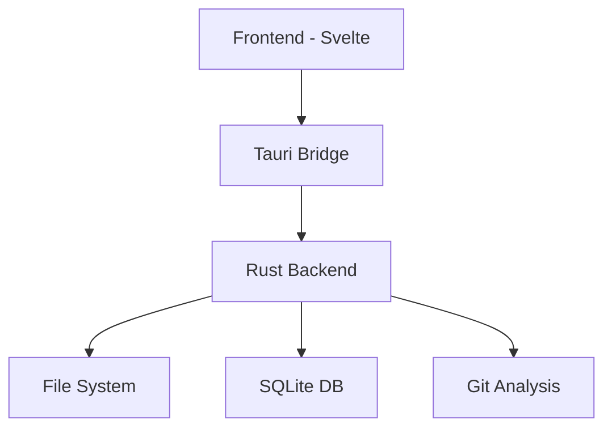
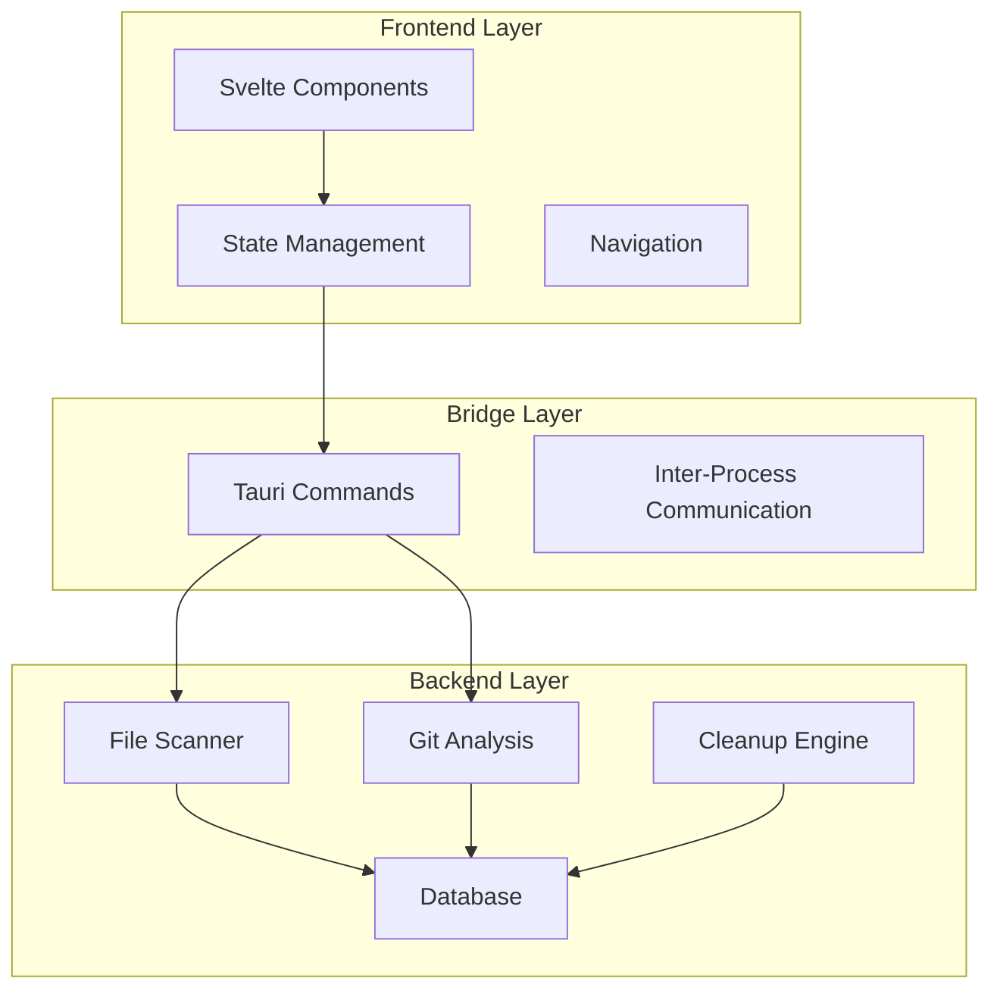
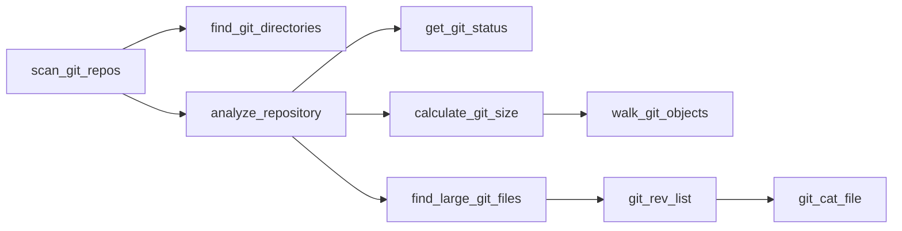
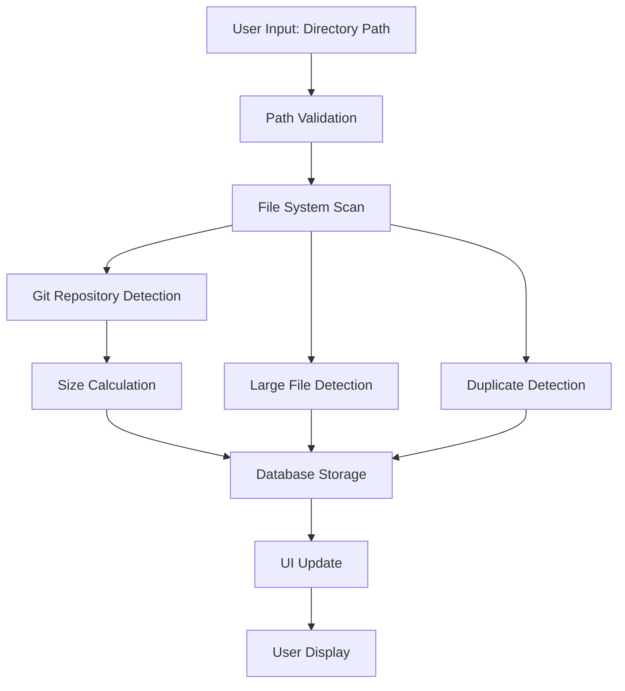
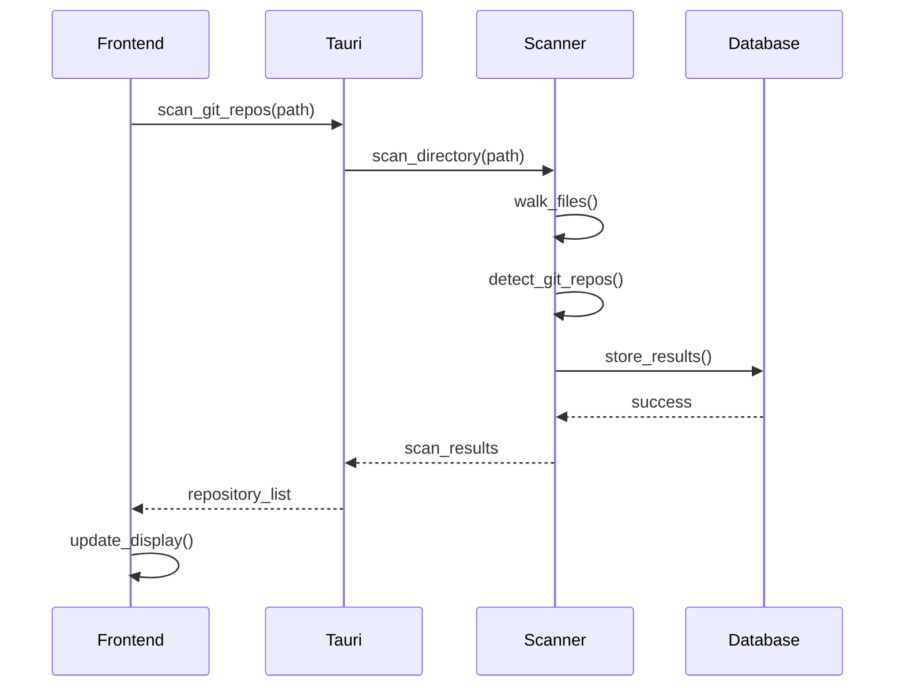

# 🎨 Architecture Visualization - Advanced Feature Concept

**Status:** 🔮 Future Feature (Phase 4+)  
**Complexity:** Very High (200+ hours)  
**Business Value:** Exceptional - Game-changing developer tool  
**Dependencies:** Tree-sitter, Mermaid.js, D3.js, Advanced parsing

---

## 🌟 Vision Statement

Transform the Project Scanner into the **ultimate architecture visualization platform** that automatically generates, maintains, and makes interactive all architectural documentation for any codebase.

---

## 🎯 Core Capabilities

### 1. **Automated Architecture Discovery**
```
Input: Any codebase (Rust, TypeScript, Python, Java, Go, etc.)
Output: Complete architectural model with relationships
```

**What it analyzes:**
- 📦 **Module Dependencies** - Package/crate relationships
- 🔗 **Function Call Graphs** - Who calls what, with parameters
- 📊 **Data Flow** - How data moves through the system
- 🏗️ **Design Patterns** - MVC, microservices, pub/sub, etc.
- 🔒 **Security Boundaries** - Trust zones and data flow
- ⚡ **Performance Paths** - Critical execution flows

### 2. **Interactive Mermaid Diagrams**


**Diagram Types:**
- 🏛️ **System Architecture** - High-level component overview
- 🕸️ **Dependency Graphs** - Module/package relationships  
- 🔄 **Sequence Diagrams** - API call flows and interactions
- 📋 **Class Diagrams** - OOP structure and inheritance
- 🗄️ **Database Schema** - Entity relationships
- 🌊 **Data Flow** - Information movement patterns
- 🔧 **Function Blocks** - Detailed function-level analysis

### 3. **Live Documentation Engine**
```
Code Change → AST Analysis → Diagram Update → Notification
     ↓              ↓             ↓             ↓
  File Watch    Incremental   Auto-refresh   Drift Alert
```

**Real-time Features:**
- 👀 **File System Watching** - Detects code changes instantly
- ⚡ **Incremental Updates** - Only re-analyzes changed components
- 🔄 **Auto-refresh** - Diagrams update without manual intervention
- 🚨 **Drift Detection** - Alerts when architecture violates patterns
- 📈 **Trend Analysis** - Shows architectural evolution over time

---

## 🎮 Interactive Features

### Click-to-Explore Navigation
```
System Diagram → Click Component → Module Details → Click Function → Code View
      ↓                ↓               ↓              ↓           ↓
  High Level      Component View   Function List   Source Code  Git History
```

### Advanced Interactions
- 🔍 **Zoom & Pan** - Navigate large, complex diagrams
- 🎯 **Search & Filter** - Find specific components or patterns
- 💡 **Hover Tooltips** - Detailed info without clicking
- 🎨 **Custom Styling** - Themes and visual customization
- 📱 **Responsive** - Works on desktop, tablet, and mobile

---

## 📊 Example Diagram Types

### 1. System Architecture (High-Level)


### 2. Function Call Graph (Detailed)


### 3. Data Flow Diagram


### 4. Sequence Diagram (API Interactions)


---

## 🛠️ Technical Implementation

### Backend Analysis Engine (Rust)
```rust
// Code analysis engine
pub struct ArchitectureAnalyzer {
    parsers: HashMap<String, TreeSitterParser>,
    dependency_graph: DependencyGraph,
    pattern_detector: PatternDetector,
}

impl ArchitectureAnalyzer {
    pub fn analyze_project(&self, path: &Path) -> ArchitectureModel {
        let files = self.discover_source_files(path);
        let ast_data = self.parse_files(files);
        let dependencies = self.extract_dependencies(ast_data);
        let patterns = self.detect_patterns(dependencies);
        
        ArchitectureModel {
            components: self.identify_components(dependencies),
            relationships: dependencies,
            patterns,
            metrics: self.calculate_metrics(),
        }
    }
}
```

### Frontend Visualization (Svelte + Mermaid)
```svelte
<script lang="ts">
  import mermaid from 'mermaid';
  import { onMount } from 'svelte';
  
  let { architectureData } = $props();
  let diagramContainer: HTMLElement;
  
  onMount(async () => {
    mermaid.initialize({ theme: 'dark' });
    const diagram = generateMermaidDiagram(architectureData);
    const { svg } = await mermaid.render('architecture', diagram);
    diagramContainer.innerHTML = svg;
    addInteractivity();
  });
  
  function addInteractivity() {
    // Add click handlers, zoom, pan, tooltips
  }
</script>

<div class="diagram-container">
  <div bind:this={diagramContainer} class="mermaid-diagram"></div>
  <div class="diagram-controls">
    <button onclick={zoomIn}>🔍+</button>
    <button onclick={zoomOut}>🔍-</button>
    <button onclick={resetView}>🎯</button>
    <button onclick={exportDiagram}>💾</button>
  </div>
</div>
```

---

## 🎨 UI/UX Design

### Architecture Tab Layout
```
┌─────────────────────────────────────────────────────────────┐
│ 🏗️ Architecture | 📊 Metrics | 🔄 Changes | ⚙️ Settings    │
├─────────────────────────────────────────────────────────────┤
│                                                             │
│  ┌─────────────┐  ┌───────────────────────────────────────┐ │
│  │ Diagram     │  │                                       │ │
│  │ Types       │  │        Interactive Diagram            │ │
│  │             │  │                                       │ │
│  │ • System    │  │     [Mermaid/D3 Visualization]       │ │
│  │ • Modules   │  │                                       │ │
│  │ • Functions │  │                                       │ │
│  │ • Data Flow │  │                                       │ │
│  │ • Sequence  │  │                                       │ │
│  │ • Classes   │  │                                       │ │
│  │             │  │                                       │ │
│  └─────────────┘  └───────────────────────────────────────┘ │
│                                                             │
│  ┌─────────────────────────────────────────────────────────┐ │
│  │ 📋 Analysis Results                                     │ │
│  │ • Components: 15 modules, 127 functions                │ │
│  │ • Patterns: MVC, Repository, Observer                  │ │
│  │ • Complexity: Medium (7.2/10)                          │ │
│  │ • Dependencies: 23 external, 45 internal              │ │
│  └─────────────────────────────────────────────────────────┘ │
└─────────────────────────────────────────────────────────────┘
```

### Interactive Features
- **Hover Effects** - Show component details on hover
- **Click Navigation** - Drill down from system → module → function
- **Search Bar** - Find specific components or patterns
- **Filter Controls** - Show/hide by complexity, type, or pattern
- **Export Options** - Save as PNG, SVG, Mermaid, or interactive HTML

---

## 📈 Advanced Analytics

### Architecture Metrics Dashboard
```
┌─────────────────────────────────────────────────────────────┐
│ 📊 Architecture Health Score: 8.5/10                       │
├─────────────────────────────────────────────────────────────┤
│                                                             │
│  Complexity:     ████████░░ 8/10    Maintainability: ████████░░ 8/10  │
│  Modularity:     ██████████ 10/10   Documentation:   ██████░░░░ 6/10  │
│  Testability:    ███████░░░ 7/10    Performance:     █████████░ 9/10  │
│                                                             │
│  🎯 Recommendations:                                        │
│  • Add unit tests for core scanning functions              │
│  • Document public API interfaces                          │
│  • Consider breaking down large modules                    │
│                                                             │
└─────────────────────────────────────────────────────────────┘
```

### Change Impact Analysis
```
┌─────────────────────────────────────────────────────────────┐
│ 🔄 Recent Changes (Last 7 days)                            │
├─────────────────────────────────────────────────────────────┤
│                                                             │
│  📅 Oct 30: Added Toast notification system                │
│  Impact: +3 components, +1 dependency, +15 functions      │
│  Architecture: ✅ Follows established patterns             │
│                                                             │
│  📅 Oct 29: Enhanced ProjectScanner with status cards      │
│  Impact: Modified 1 component, +8 functions               │
│  Architecture: ✅ Maintains separation of concerns         │
│                                                             │
│  📅 Oct 28: Refactored lib.rs into modular structure      │
│  Impact: -109 lines, +3 modules, improved modularity      │
│  Architecture: ✅ Significant improvement in organization   │
│                                                             │
└─────────────────────────────────────────────────────────────┘
```

---

## 🚀 Implementation Phases

### Phase 1: Foundation (40 hours)
- **Basic Code Parsing** - Tree-sitter integration for Rust/TypeScript
- **Simple Diagrams** - System architecture and module dependencies
- **Mermaid Integration** - Basic diagram rendering
- **File Watching** - Detect code changes

### Phase 2: Interactivity (60 hours)
- **Click Navigation** - Drill-down functionality
- **Advanced Diagrams** - Function calls, data flow, sequences
- **D3.js Integration** - Zoom, pan, search, filter
- **Export System** - Multiple format support

### Phase 3: Intelligence (80 hours)
- **Pattern Detection** - Identify architectural patterns
- **Performance Analysis** - Hotspot visualization
- **Security Analysis** - Boundary and flow tracking
- **Compliance Checking** - Validate against design rules

### Phase 4: Advanced Features (120 hours)
- **Multi-language Support** - Python, Java, Go parsers
- **Real-time Collaboration** - Shared diagram editing
- **AI-Powered Insights** - Automated recommendations
- **Integration APIs** - Connect with external tools

---

## 💡 Business Value Proposition

### For Developers
- **Instant Understanding** - Comprehend any codebase in minutes
- **Onboarding Acceleration** - New team members productive faster
- **Architecture Validation** - Ensure design consistency
- **Documentation Automation** - Always up-to-date diagrams

### For Teams
- **Knowledge Sharing** - Visual communication of complex systems
- **Code Reviews** - Architectural impact assessment
- **Technical Debt** - Identify and track architectural issues
- **Compliance** - Validate against architectural standards

### For Organizations
- **Risk Reduction** - Prevent architectural drift and technical debt
- **Productivity Gains** - Faster development and maintenance
- **Quality Improvement** - Better architectural decisions
- **Competitive Advantage** - Superior development tooling

---

## 🎯 Success Metrics

### Technical Metrics
- **Analysis Speed** - <30 seconds for 100K lines of code
- **Accuracy** - >95% correct dependency detection
- **Performance** - <2 seconds diagram rendering
- **Coverage** - Support for 10+ programming languages

### User Experience Metrics
- **Comprehension Time** - 80% reduction in codebase understanding time
- **Adoption Rate** - >90% of developers use regularly
- **Satisfaction Score** - >4.5/5 user rating
- **Documentation Quality** - 100% up-to-date architectural docs

### Business Impact
- **Onboarding Time** - 50% faster new developer productivity
- **Code Review Efficiency** - 30% faster architectural reviews
- **Technical Debt** - 40% reduction in architectural violations
- **Development Velocity** - 25% faster feature development

---

## 🔮 Future Vision

This feature would position the Project Scanner as:

1. **The Ultimate Developer Tool** - Essential for any serious development team
2. **Architecture Documentation Platform** - Industry standard for visual documentation
3. **Code Intelligence Engine** - AI-powered insights and recommendations
4. **Collaboration Hub** - Central place for architectural discussions

**Long-term Goal:** Become the **"GitHub for Architecture"** - where every project's architectural evolution is tracked, visualized, and shared.

---

**Status:** 🔮 Visionary Feature  
**Timeline:** 6-12 months development  
**Investment:** $200K-400K development cost  
**ROI:** Potentially $10M+ market opportunity

This would be a **game-changing feature** that could transform the Project Scanner from a utility into a must-have platform for every development team!