# Automatic Diagram Generation - COMPLETE ✅

**Date:** October 30, 2025  
**Status:** ✅ FULLY IMPLEMENTED  
**Feature:** Multi-format automatic diagram generation for Architecture Visualization

## 🎯 What We Built

### **Automatic Diagram Types**
1. **📊 Architecture Overview** - High-level module relationships with language-specific styling
2. **🔗 Dependency Graph** - Detailed import/export connections with directory grouping
3. **🏗️ Class Hierarchy** - Object-oriented structure with inheritance and interfaces
4. **📁 File Organization** - Directory structure with file type icons
5. **🎯 Graphviz DOT** - Professional layout format for advanced visualization
6. **📐 PlantUML** - UML diagrams with package organization

### **Multiple Export Formats**
- **Mermaid** - For web display and interactive editing
- **Graphviz DOT** - For professional layouts and advanced tools
- **PlantUML** - For UML diagrams and documentation
- **File Export** - Automatic saving to project directories

## 🚀 Implementation Details

### **Backend (Rust) - 6 New Diagram Generators**

#### 1. Architecture Overview (Enhanced Mermaid)
```rust
pub fn generate_architecture_overview(&self, modules: &[ModuleInfo], dependencies: &[DependencyRelation])
```
- **Language-specific node coloring**
- **Module size indicators** (line counts)
- **Clean dependency arrows**
- **CSS styling classes**

#### 2. Dependency Graph
```rust
pub fn generate_dependency_graph(&self, modules: &[ModuleInfo], dependencies: &[DependencyRelation])
```
- **Directory-based subgraphs**
- **Import/export relationship mapping**
- **Hierarchical organization**
- **Clean visual separation**

#### 3. Class Hierarchy
```rust
pub fn generate_class_hierarchy(&self, modules: &[ModuleInfo])
```
- **UML-style class diagrams**
- **Property and method listings**
- **Inheritance relationships** (`<|--`)
- **Interface implementations** (`<|..`)
- **Visibility indicators** (+/-)

#### 4. File Organization
```rust
pub fn generate_file_organization(&self, modules: &[ModuleInfo])
```
- **Directory tree structure**
- **File type icons** (🦀 Rust, 📘 TypeScript, 🐍 Python, etc.)
- **Hierarchical folder representation**
- **Visual file categorization**

#### 5. Graphviz DOT Format
```rust
pub fn generate_graphviz_diagram(&self, modules: &[ModuleInfo], dependencies: &[DependencyRelation])
```
- **Professional layout engine**
- **Language-based node coloring**
- **Scalable vector output**
- **Advanced positioning algorithms**

#### 6. PlantUML Format
```rust
pub fn generate_plantuml_diagram(&self, modules: &[ModuleInfo], dependencies: &[DependencyRelation])
```
- **Package-based organization**
- **Language grouping**
- **UML standard compliance**
- **Documentation integration**

### **Frontend (Svelte 5) - Enhanced UI**

#### Interactive Diagram Selection
```svelte
<select bind:value={selectedDiagramType}>
  <option value="overview">📊 Architecture Overview</option>
  <option value="dependency">🔗 Dependency Graph</option>
  <option value="class">🏗️ Class Hierarchy</option>
  <option value="files">📁 File Organization</option>
  <option value="graphviz">🎯 Graphviz DOT</option>
  <option value="plantuml">📐 PlantUML</option>
</select>
```

#### Automatic Generation Controls
- **🚀 Generate All Types** - Creates all 6 diagram types automatically
- **Generate Selected** - Creates specific diagram type
- **💾 Export All** - Saves all diagrams to files
- **📋 Copy** - One-click clipboard copy

#### Smart Display System
- **Tabbed interface** for each diagram type
- **Syntax highlighting** for code blocks
- **External tool links** (mermaid.live, Graphviz Online, PlantUML Online)
- **Progress indicators** during generation

## 🎨 Sample Output

### Architecture Overview (Mermaid)


### Class Hierarchy (Mermaid)


### File Organization (Mermaid)

```mermaid
graph TD
    src["📁 src"]
    src_tauri["📁 src-tauri"]
    
    src --> lib_rs["🦀 lib.rs"]
    src --> components["📁 components"]
    components --> archviz["📘 ArchitectureVisualization.svelte"]
    
    src_tauri --> main_rs["🦀 main.rs"]
    src_tauri --> arch_viz_mod["🦀 arch_viz/mod.rs"]
```


### Graphviz DOT


## 🔧 Tauri Commands Added

### 1. Enhanced `generate_diagram`
```rust
async fn generate_diagram(
    project_path: String, 
    format: String, 
    diagram_type: Option<String>
) -> Result<String, String>
```
- **Supports all 6 diagram types**
- **Real-time generation**
- **Error handling with detailed messages**

### 2. New `export_all_diagrams`
```rust
async fn export_all_diagrams(
    project_path: String, 
    output_dir: Option<String>
) -> Result<Vec<String>, String>
```
- **Batch export functionality**
- **Automatic file naming** (.mmd, .dot, .puml)
- **Directory creation**
- **Success/failure reporting**

## 🎯 User Experience Flow

### 1. **Navigate to Architecture Visualization**
- Press Alt+V or click sidebar button
- Select project directory

### 2. **Run Analysis**
- Click "Analyze Project Architecture"
- Wait for analysis completion (5-30 seconds)

### 3. **Generate Diagrams Automatically**
- Click **"🚀 Generate All Types"** for automatic generation
- OR select specific type and click **"Generate Selected"**
- Watch progress indicators

### 4. **View and Use Diagrams**
- **Browse tabs** for each diagram type
- **Copy code** with one-click buttons
- **Open in external tools** via provided links
- **Export to files** for documentation

### 5. **Export for Documentation**
- Click **"💾 Export All"** to save files
- Files saved to `{project}/diagrams/` directory
- Use in documentation, presentations, wikis

## 🔗 Integration with External Tools

### **Mermaid Diagrams**
- **mermaid.live** - Interactive editing and PNG export
- **GitHub/GitLab** - Native Mermaid rendering in markdown
- **Notion, Obsidian** - Direct Mermaid support

### **Graphviz DOT**
- **Graphviz Online** - Web-based rendering
- **Local Graphviz** - Command-line tools (dot, neato, circo)
- **VS Code extensions** - Live preview

### **PlantUML**
- **PlantUML Online** - Web rendering
- **IntelliJ/VS Code** - IDE plugins
- **Confluence, Jira** - Native PlantUML support

## 🎉 Benefits Achieved

### ✅ **Automatic Generation**
- **No manual diagram creation** - Everything generated from code
- **Always up-to-date** - Reflects current project structure
- **Multiple perspectives** - 6 different views of same codebase

### ✅ **Professional Quality**
- **Publication-ready** diagrams for documentation
- **Multiple formats** for different use cases
- **Clean, readable** output with proper styling

### ✅ **Developer Productivity**
- **Instant architecture insights** for new team members
- **Code review assistance** with visual structure
- **Documentation automation** for wikis and specs

### ✅ **Integration Ready**
- **Copy-paste friendly** for immediate use
- **File export** for version control
- **External tool compatibility** for advanced editing

## 🚀 Advanced Features Ready

### **Future Enhancements** (Easy to add)
1. **SVG/PNG Export** - Direct image generation
2. **Interactive Diagrams** - Clickable nodes with drill-down
3. **Real-time Updates** - File watching for live diagrams
4. **Custom Styling** - User-defined colors and layouts
5. **Diagram Comparison** - Before/after architecture changes

### **Enterprise Features** (Specification ready)
1. **Batch Processing** - Multiple projects at once
2. **CI/CD Integration** - Automated diagram generation
3. **Template System** - Standardized diagram formats
4. **Metrics Integration** - Quality scores in diagrams

---

**Status:** ✅ COMPLETE - Automatic diagram generation fully implemented and ready for production use!

The Architecture Visualization now automatically generates professional-quality diagrams in multiple formats, making it a powerful tool for code documentation, team onboarding, and architectural analysis.