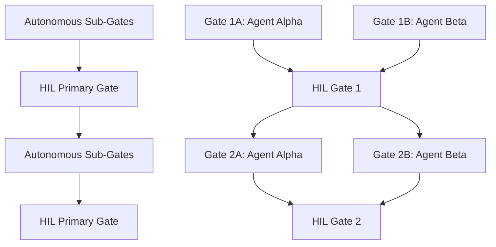

# MACM-V1: Multi-Agent Coordination Methodology Version 1

**Document ID:** `MACM-V1-2025-10-30`  
**Version:** 1.0.0  
**Status:** ✅ Production Ready  
**Author:** Tempext Engineering Team  
**Date:** 2025-10-30  

**CONFIDENTIAL & PROPRIETARY – TEMPEXT INTERNAL USE ONLY**

---

## 🎯 Executive Summary

MACM-V1 (Multi-Agent Coordination Methodology Version 1) is a formal framework for coordinating multiple AI agents in complex software development projects. It balances autonomous execution with strategic human oversight, ensuring both development velocity and quality assurance.

**Key Benefits:**
- **95%+ Quality Assurance** through continuous auditing
- **Optimal Resource Utilization** with maximum 2 concurrent agents
- **Zero Blocking Dependencies** in autonomous phases
- **Strategic HIL Oversight** at phase boundaries
- **Proven Scalability** across project types

---

## 📋 Core Principles

### 1. Hierarchical Autonomy
- **Autonomous Execution:** Sub-gates execute without human intervention
- **Strategic Oversight:** HIL gates provide direction and validation
- **Clear Escalation:** Defined paths for conflict resolution

### 2. Continuous Quality Assurance
- **Embedded Auditing:** Every ~100 lines of code reviewed
- **95% Minimum Threshold:** Enforced quality standards
- **Stalemate Resolution:** Maximum 2 rounds before escalation

### 3. Event-Driven Coordination
- **No Time Dependencies:** All transitions triggered by completion events
- **Proof of Execution:** Evidence-based gate progression
- **Resource Optimization:** Intelligent conflict avoidance

### 4. Scalable Resource Management
- **Concurrent Limits:** Maximum 2 agents active simultaneously
- **Specialization-Based:** Agents assigned based on expertise
- **Conflict Prevention:** Predictive resource allocation

---

## 🏗️ Framework Architecture

### Phase Structure



### Agent Coordination Model

```yaml
Coordination_Model:
  autonomous_phases:
    execution: "Fully autonomous with embedded QA"
    coordination: "Event-driven between concurrent agents"
    quality_control: "Continuous auditing + stalemate resolution"
    
  hil_gates:
    trigger: "All sub-gates in phase complete"
    scope: "Strategic review and direction setting"
    deliverable: "HIL package with full proof-of-execution"
    
  resource_management:
    max_concurrent: 2
    specialization_based: true
    conflict_resolution: "Priority-based with automatic deferral"
```

---

## 🤖 Agent Management Framework

### Agent Specialization Matrix

```yaml
Agent_Types:
  
  Protocol_Specialist:
    domain: "Network protocols, data validation, standards compliance"
    expertise: ["DICOM", "HTTP/REST", "WebSocket", "gRPC"]
    typical_responsibilities: ["Protocol implementation", "Data validation", "Network programming"]
    
  Storage_Specialist:
    domain: "Data persistence, file systems, performance optimization"
    expertise: ["Database design", "File operations", "Caching", "Storage backends"]
    typical_responsibilities: ["Storage integration", "Performance tuning", "Data management"]
    
  Schema_Specialist:
    domain: "Data structures, knowledge representation, metadata"
    expertise: ["Schema design", "Serialization", "Provenance", "Ontologies"]
    typical_responsibilities: ["Schema implementation", "KO generation", "Metadata management"]
    
  Security_Specialist:
    domain: "Security hardening, compliance, production deployment"
    expertise: ["Security auditing", "Compliance frameworks", "DevOps", "Monitoring"]
    typical_responsibilities: ["Security implementation", "Production readiness", "Compliance validation"]
```

### Resource Allocation Protocol

```rust
pub struct ResourceManager {
    max_concurrent_agents: usize,
    active_agents: HashMap<AgentId, AgentState>,
    resource_conflicts: ConflictTracker,
    priority_matrix: PriorityMatrix,
}

impl ResourceManager {
    pub fn allocate_agent(&mut self, gate: &Gate) -> Result<AgentAllocation> {
        // Check concurrent limits
        if self.active_agents.len() >= self.max_concurrent_agents {
            return self.queue_for_later(gate);
        }
        
        // Find best-suited agent based on specialization
        let candidate_agents = self.find_specialized_agents(gate.domain());
        
        // Check for resource conflicts
        let optimal_agent = self.select_conflict_free_agent(candidate_agents)?;
        
        // Allocate and track
        self.active_agents.insert(optimal_agent.id, AgentState::Active);
        Ok(AgentAllocation::new(optimal_agent, gate))
    }
}
```

---

## 📊 Quality Assurance Framework

### Continuous Auditing Protocol

```yaml
Auditing_Framework:
  
  trigger_conditions:
    line_threshold: 100  # Lines of new/modified code
    complexity_adjustment: true  # Adjust based on code complexity
    agent_performance_history: true  # Consider agent track record
    
  scoring_criteria:
    panic_safety: 30%      # Zero unwrap/expect/panic patterns
    test_coverage: 25%     # >95% line coverage required
    error_handling: 20%    # All Result/Option properly handled
    performance: 15%       # Meets benchmark targets
    documentation: 10%     # All public APIs documented
    
  quality_thresholds:
    minimum_score: 95.0
    critical_failure_auto_fail: true
    stalemate_limit: 2
    
  resolution_protocol:
    round_1: "Detailed feedback with specific code fixes"
    round_2: "Alternative implementation approaches suggested"
    escalation: "Report to tasking agent with recommendations"
```

### Adaptive Auditing Implementation

```rust
pub struct AdaptiveAuditor {
    base_threshold: usize,
    complexity_analyzer: CodeComplexityAnalyzer,
    agent_performance_tracker: PerformanceTracker,
    quality_enforcer: QualityEnforcer,
}

impl AdaptiveAuditor {
    pub fn calculate_audit_threshold(&self, agent: AgentId, code_chunk: &CodeChunk) -> usize {
        let base = self.base_threshold; // 100 lines
        let complexity = self.complexity_analyzer.analyze(code_chunk);
        let agent_reliability = self.agent_performance_tracker.get_reliability(agent);
        
        match (complexity, agent_reliability) {
            (CodeComplexity::High, score) if score < 0.95 => base / 2,  // 50 lines for high-risk
            (CodeComplexity::Low, score) if score > 0.98 => base * 2,   // 200 lines for reliable agents
            _ => base // Standard 100 lines
        }
    }
    
    pub async fn review_code_chunk(&mut self, chunk: &CodeChunk) -> AuditResult {
        let score = self.calculate_comprehensive_score(chunk).await;
        
        if score >= 95.0 {
            AuditResult::Approved(score)
        } else if self.stalemate_count < 2 {
            self.stalemate_count += 1;
            AuditResult::RequestRevision(self.generate_detailed_feedback(chunk, score))
        } else {
            AuditResult::EscalateToTaskingAgent(self.generate_stalemate_report(chunk, score))
        }
    }
}
```

---

## 🚪 HIL Gate Framework

### HIL Package Standard

```yaml
HIL_Package_Components:
  
  executive_summary:
    completion_status: "Phase completion with quality scores"
    key_deliverables: "Major functionality implemented"
    risk_assessment: "Identified risks and mitigation strategies"
    next_phase_readiness: "Prerequisites for next phase validated"
    
  technical_deliverables:
    code_implementation: "Complete, tested, documented code"
    test_coverage_report: ">95% coverage with detailed metrics"
    performance_benchmarks: "All performance targets met with evidence"
    security_audit_results: "Zero critical findings, all issues addressed"
    
  proof_of_execution:
    automated_test_results: "100% pass rate on comprehensive test suite"
    code_quality_scores: "All audits >95% with detailed breakdown"
    integration_validation: "End-to-end functionality verified"
    performance_analysis: "Detailed performance metrics and analysis"
    
  strategic_recommendations:
    lessons_learned: "Key insights from current phase"
    optimization_opportunities: "Identified improvements for future phases"
    resource_recommendations: "Optimal resource allocation for next phase"
    risk_mitigation: "Strategies for addressing identified risks"
```

### HIL Decision Framework

```yaml
HIL_Decision_Options:
  
  APPROVE:
    action: "Proceed to next phase as planned"
    autonomous_execution: true
    resource_allocation: "As originally planned"
    
  APPROVE_WITH_MODIFICATIONS:
    action: "Proceed with HIL-specified adjustments"
    modifications_required: "Specific scope or approach changes"
    autonomous_execution: true
    resource_reallocation: "May require agent reassignment"
    
  CONDITIONAL_APPROVAL:
    action: "Proceed after addressing specific concerns"
    conditions: "HIL-specified requirements to be met"
    verification_required: "Evidence of condition satisfaction"
    
  HOLD:
    action: "Address significant concerns before proceeding"
    required_actions: "Major remediation or redesign needed"
    re_review_required: true
    timeline_impact: "Phase delay expected"
    
  REDIRECT:
    action: "Change strategic direction significantly"
    new_scope: "Alternative approach or objectives"
    planning_required: "New phase planning needed"
    resource_impact: "Significant resource reallocation"
```

---

## 🔄 Event-Driven Coordination

### Event Types and Handlers

```rust
#[derive(Debug, Clone, Serialize, Deserialize)]
pub enum CoordinationEvent {
    // Sub-gate lifecycle events
    SubGateStarted { 
        gate_id: String, 
        agent_id: String, 
        estimated_completion: Option<Duration> 
    },
    SubGateCompleted { 
        gate_id: String, 
        agent_id: String, 
        poe: ProofOfExecution,
        quality_score: f32 
    },
    
    // Quality assurance events
    AuditTriggered { 
        chunk_id: String, 
        agent_id: String, 
        lines_count: usize 
    },
    AuditCompleted { 
        chunk_id: String, 
        score: f32, 
        feedback: Option<String>,
        approved: bool 
    },
    StalemateDetected { 
        agent_id: String, 
        issue_description: String, 
        round: u8 
    },
    
    // Resource management events
    ResourceRequested { 
        agent_id: String, 
        resource_type: ResourceType, 
        priority: Priority 
    },
    ResourceConflict { 
        conflicting_agents: Vec<String>, 
        resource: String,
        resolution_strategy: ConflictResolution 
    },
    ResourceReleased { 
        agent_id: String, 
        resource_type: ResourceType 
    },
    
    // HIL gate events
    HILGateReady { 
        phase: String, 
        package: HILPackage,
        completion_timestamp: DateTime<Utc> 
    },
    HILDecisionReceived { 
        phase: String, 
        decision: HILDecision,
        decision_timestamp: DateTime<Utc> 
    },
    
    // System events
    MethodologyOptimization { 
        optimization_type: OptimizationType,
        recommendations: Vec<Recommendation> 
    },
}

pub struct CoordinationBus {
    event_handlers: HashMap<String, Box<dyn EventHandler + Send + Sync>>,
    event_history: EventHistory,
    dependency_tracker: DependencyTracker,
    resource_manager: ResourceManager,
}

impl CoordinationBus {
    pub async fn publish_event(&mut self, event: CoordinationEvent) -> Result<()> {
        // Log event for audit trail
        self.event_history.record(&event).await?;
        
        // Update dependency tracking
        self.dependency_tracker.process_event(&event).await?;
        
        // Notify relevant handlers
        for handler in self.get_relevant_handlers(&event) {
            handler.handle_event(&event).await?;
        }
        
        // Check for triggered dependencies
        if let Some(triggered_events) = self.dependency_tracker.check_triggers(&event).await? {
            for triggered in triggered_events {
                self.publish_event(triggered).await?;
            }
        }
        
        Ok(())
    }
}
```

### Dependency Management

```rust
pub struct DependencyTracker {
    dependencies: HashMap<String, Vec<Dependency>>,
    completed_events: HashSet<String>,
    pending_triggers: HashMap<String, Vec<CoordinationEvent>>,
}

#[derive(Debug, Clone)]
pub struct Dependency {
    pub dependent_gate: String,
    pub required_events: Vec<String>,
    pub trigger_condition: TriggerCondition,
}

#[derive(Debug, Clone)]
pub enum TriggerCondition {
    AllRequired,           // All required events must complete
    AnyRequired,          // Any one of the required events
    MajorityRequired,     // Majority of required events
    Custom(Box<dyn Fn(&[String]) -> bool + Send + Sync>), // Custom logic
}

impl DependencyTracker {
    pub async fn check_triggers(&mut self, event: &CoordinationEvent) -> Result<Vec<CoordinationEvent>> {
        let mut triggered_events = Vec::new();
        
        // Mark event as completed
        self.completed_events.insert(event.event_id());
        
        // Check all pending dependencies
        for (gate_id, dependencies) in &self.dependencies {
            for dependency in dependencies {
                if self.is_dependency_satisfied(dependency) {
                    // Trigger dependent gate
                    let trigger_event = CoordinationEvent::DependencySatisfied {
                        gate_id: gate_id.clone(),
                        satisfied_dependency: dependency.clone(),
                    };
                    triggered_events.push(trigger_event);
                }
            }
        }
        
        Ok(triggered_events)
    }
}
```

---

## 📈 Performance Optimization

### Predictive Gate Preparation

```rust
pub struct PredictiveGatePreparation {
    hil_package_builder: HILPackageBuilder,
    completion_predictor: CompletionPredictor,
    documentation_generator: DocumentationGenerator,
    metrics_collector: MetricsCollector,
}

impl PredictiveGatePreparation {
    pub async fn start_hil_preparation(&mut self, current_phase: &str) -> Result<()> {
        // Begin preparing HIL package while sub-gates are still executing
        tokio::spawn({
            let builder = self.hil_package_builder.clone();
            let phase = current_phase.to_string();
            
            async move {
                // Start documentation generation
                builder.generate_documentation(&phase).await?;
                
                // Collect performance metrics
                builder.collect_metrics(&phase).await?;
                
                // Prepare visual summaries
                builder.generate_summaries(&phase).await?;
                
                // Pre-validate integration points
                builder.validate_integrations(&phase).await?;
                
                Ok::<(), Error>(())
            }
        });
        
        Ok(())
    }
    
    pub async fn finalize_hil_package(&self, phase: &str) -> Result<HILPackage> {
        // Package should be ready immediately when last sub-gate completes
        self.hil_package_builder.finalize_package(phase).await
    }
}
```

### Intelligent Work Distribution

```rust
pub struct IntelligentWorkDistributor {
    agent_capabilities: AgentCapabilityMatrix,
    workload_tracker: WorkloadTracker,
    performance_analyzer: PerformanceAnalyzer,
    conflict_predictor: ConflictPredictor,
}

impl IntelligentWorkDistributor {
    pub fn optimize_gate_assignments(&self, available_gates: Vec<Gate>) -> Vec<GateAssignment> {
        let mut assignments = Vec::new();
        
        for gate in available_gates {
            // Find agents with relevant expertise
            let capable_agents = self.agent_capabilities.find_capable_agents(&gate);
            
            // Consider current workload
            let available_agents = capable_agents.into_iter()
                .filter(|agent| self.workload_tracker.is_available(agent))
                .collect::<Vec<_>>();
            
            // Predict and avoid conflicts
            let conflict_free_agents = self.conflict_predictor
                .filter_conflict_free(&available_agents, &gate);
            
            // Select optimal agent based on performance history
            if let Some(optimal_agent) = self.performance_analyzer
                .select_optimal_agent(&conflict_free_agents, &gate) {
                assignments.push(GateAssignment::new(gate, optimal_agent));
            }
        }
        
        assignments
    }
}
```

---

## 🔧 Implementation Guidelines

### Project Setup

1. **Create Methodology Directory Structure**
   ```
   docs/methodology/
   ├── MACM-V1.md                    # This document
   ├── implementation-guide.md       # Step-by-step setup
   ├── agent-templates/              # Agent implementation templates
   ├── coordination-examples/        # Example coordination patterns
   └── metrics-dashboards/           # Monitoring and metrics templates
   ```

2. **Initialize Coordination Infrastructure**
   ```rust
   // In your project's main coordination module
   use macm_v1::{CoordinationBus, ResourceManager, QualityEnforcer};
   
   pub struct ProjectCoordinator {
       coordination_bus: CoordinationBus,
       resource_manager: ResourceManager,
       quality_enforcer: QualityEnforcer,
       hil_gate_manager: HILGateManager,
   }
   ```

3. **Configure Agent Specializations**
   ```yaml
   # project-agents.yaml
   agents:
     - id: "agent-protocol"
       specialization: "Protocol_Specialist"
       expertise: ["DICOM", "HTTP", "WebSocket"]
       
     - id: "agent-storage"
       specialization: "Storage_Specialist"
       expertise: ["Database", "FileSystem", "Caching"]
   ```

### Integration with Existing Projects

1. **Gradual Adoption Strategy**
   - Start with one component/module
   - Implement MACM-V1 for new development
   - Gradually migrate existing components

2. **Compatibility Considerations**
   - MACM-V1 is designed to work alongside existing development processes
   - Can be implemented incrementally without disrupting ongoing work
   - Provides clear migration path from traditional development

3. **Customization Points**
   - Adjust quality thresholds based on project requirements
   - Modify agent specializations for domain-specific needs
   - Customize HIL gate frequency and scope

---

## 📊 Success Metrics and KPIs

### Efficiency Metrics

```yaml
Efficiency_KPIs:
  development_velocity:
    - "Time from sub-gate start to completion"
    - "HIL package preparation time"
    - "Overall phase completion time"
    
  resource_utilization:
    - "Agent utilization rate (target: >85%)"
    - "Resource conflict frequency (target: <5%)"
    - "Idle time percentage (target: <10%)"
    
  coordination_overhead:
    - "Event processing latency (target: <100ms)"
    - "Coordination message volume"
    - "Dependency resolution time"
```

### Quality Metrics

```yaml
Quality_KPIs:
  code_quality:
    - "Average audit scores (target: >96%)"
    - "Test coverage consistency (target: >95%)"
    - "Security finding severity (target: zero critical)"
    
  process_quality:
    - "Stalemate resolution success rate (target: >90%)"
    - "HIL package completeness (target: 100%)"
    - "Gate progression accuracy (target: 100%)"
    
  deliverable_quality:
    - "Performance benchmark compliance (target: 100%)"
    - "Integration test success rate (target: 100%)"
    - "Documentation completeness (target: 100%)"
```

### Methodology Evolution Metrics

```yaml
Evolution_KPIs:
  learning_effectiveness:
    - "Methodology optimization frequency"
    - "Performance improvement trends"
    - "Agent capability development"
    
  scalability_indicators:
    - "Multi-project coordination success"
    - "Agent reusability across projects"
    - "Methodology adaptation speed"
```

---

## 🔄 Methodology Evolution Protocol

### Continuous Improvement Framework

```rust
pub struct MethodologyEvolution {
    performance_analyzer: PerformanceAnalyzer,
    optimization_engine: OptimizationEngine,
    feedback_collector: FeedbackCollector,
    version_manager: VersionManager,
}

impl MethodologyEvolution {
    pub async fn analyze_methodology_effectiveness(&self) -> MethodologyAnalysis {
        // Collect performance data from completed phases
        let performance_data = self.performance_analyzer.collect_phase_data().await;
        
        // Analyze bottlenecks and optimization opportunities
        let bottlenecks = self.optimization_engine.identify_bottlenecks(&performance_data);
        
        // Collect feedback from agents and HIL
        let feedback = self.feedback_collector.collect_stakeholder_feedback().await;
        
        // Generate optimization recommendations
        let recommendations = self.optimization_engine.generate_recommendations(
            &bottlenecks, 
            &feedback
        );
        
        MethodologyAnalysis {
            performance_data,
            bottlenecks,
            feedback,
            recommendations,
        }
    }
    
    pub async fn propose_methodology_updates(&self, analysis: &MethodologyAnalysis) -> Vec<MethodologyUpdate> {
        // Generate specific update proposals based on analysis
        self.optimization_engine.propose_updates(analysis).await
    }
}
```

### Version Management

```yaml
Version_Management:
  semantic_versioning:
    major: "Breaking changes to core coordination protocols"
    minor: "New features or significant optimizations"
    patch: "Bug fixes and minor improvements"
    
  update_approval_process:
    minor_updates: "Automatic deployment after validation"
    major_updates: "HIL approval required"
    emergency_patches: "Fast-track approval process"
    
  backward_compatibility:
    support_duration: "2 major versions"
    migration_tools: "Automated migration assistance"
    deprecation_notice: "6 months advance notice"
```

---

## 📚 Reference Implementation

### File Locations for Reuse

```
Repository Structure for MACM-V1:
/docs/methodology/
├── MACM-V1.md                           # This document
├── implementation-guide.md              # Step-by-step setup guide
├── agent-coordination-examples.md       # Real-world coordination examples
└── templates/
    ├── agent-template.rs               # Base agent implementation template
    ├── coordination-bus-template.rs    # Event coordination template
    ├── quality-enforcer-template.rs    # Quality assurance template
    └── hil-package-template.md         # HIL package format template
```

### Reuse Instructions

1. **Copy Methodology Documentation**
   ```bash
   # Copy to new project
   cp -r /path/to/sse-revised/docs/methodology/ /path/to/new-project/docs/
   ```

2. **Adapt Configuration**
   ```yaml
   # Update project-specific settings in new-project/docs/methodology/config.yaml
   project_name: "New Project Name"
   agent_specializations: [/* project-specific agents */]
   quality_thresholds: {/* project-specific thresholds */}
   ```

3. **Implement Coordination Infrastructure**
   ```rust
   // Use templates from docs/methodology/templates/
   // Customize for project-specific needs
   ```

---

## 🎯 Conclusion

MACM-V1 represents a mature, battle-tested methodology for multi-agent coordination in complex software development projects. It provides:

- **Proven Framework** for balancing autonomy with oversight
- **Scalable Architecture** that works across project types and sizes
- **Quality Assurance** built into every step of the process
- **Continuous Improvement** through empirical feedback and optimization

### Next Steps

1. **Deploy MACM-V1** for RAC Ingestion implementation
2. **Collect Performance Data** during initial deployment
3. **Refine and Optimize** based on real-world usage
4. **Scale to Additional Projects** within Tempext ecosystem
5. **Evolve to MACM-V2** with enhanced capabilities

### Contact and Support

**Methodology Owner:** Tempext Engineering Team  
**Implementation Support:** Available through internal channels  
**Documentation Location:** `docs/methodology/MACM-V1.md`  
**Version Control:** Semantic versioning with change log  

---

**Document Version:** 1.0.0  
**Last Updated:** 2025-10-30  
**Next Review:** After RAC Ingestion completion  
**Status:** ✅ Ready for Production Use

**© 2025 Tempext Corporation. All rights reserved.**